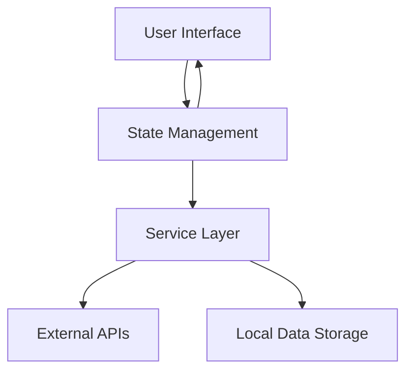

# Design Document: Integrated Trading Platform

## Overview

This design document outlines the architecture and implementation approach for transforming the current trading platform into a cohesive, integrated application. The platform will unify existing components into a seamless experience with three main sections: a homepage displaying cryptocurrency coins, a trading execution page, and a trade testing/backtesting page. The design will leverage Ant Design for consistent UI/UX and implement efficient state management to ensure data consistency across the platform.

## Architecture

### High-Level Architecture

The integrated trading platform will follow a modular architecture with a centralized state management system. The architecture consists of the following layers:

1. **Presentation Layer**: React components using Ant Design for UI rendering
2. **State Management Layer**: Centralized state management using React Context API
3. **Service Layer**: API services for data fetching and processing
4. **Data Layer**: Data models and persistence mechanisms



### Technical Stack

- **Frontend Framework**: Next.js with React
- **UI Library**: Ant Design
- **State Management**: React Context API with custom hooks
- **Data Fetching**: Custom API services with caching mechanisms
- **Charting**: Lightweight charting library (existing implementation)
- **Testing**: Jest for unit tests, React Testing Library for component tests

## Components and Interfaces

### Core Components

#### 1. Navigation System

A unified navigation component that provides consistent access to all platform sections.

```typescript
interface NavigationProps {
  currentPath: string;
  user?: UserProfile;
}
```

#### 2. Layout Components

Standardized layout components that maintain consistent structure across pages.

```typescript
interface PageContainerProps {
  title: string;
  children: React.ReactNode;
  loading?: boolean;
  extra?: React.ReactNode;
}
```

#### 3. Homepage Components

Components for displaying cryptocurrency listings and market overview.

```typescript
interface CoinListProps {
  coins: CoinData[];
  onCoinSelect: (coin: CoinData) => void;
  sortBy?: string;
  filterOptions?: FilterOptions;
}

interface MarketOverviewProps {
  marketStats: MarketStats;
  trendingCoins: CoinData[];
}
```

#### 4. Trading Page Components

Components for chart display, order entry, and position management.

```typescript
interface TradingViewProps {
  symbol: string;
  interval: string;
  indicators: Indicator[];
  onIntervalChange: (interval: string) => void;
}

interface OrderEntryProps {
  symbol: string;
  balance: Balance;
  onOrderSubmit: (order: OrderData) => Promise<OrderResult>;
}

interface PositionTableProps {
  positions: Position[];
  onPositionClose: (positionId: string) => void;
}
```

#### 5. Testing Page Components

Components for configuring and displaying backtest results.

```typescript
interface BacktestConfigProps {
  availableStrategies: Strategy[];
  availableTimeframes: Timeframe[];
  onRunBacktest: (config: BacktestConfig) => void;
}

interface BacktestResultsProps {
  results: BacktestResult;
  comparisonResults?: BacktestResult[];
}
```

### Page Structure

#### Homepage
- Header with navigation
- Market overview section
- Coin listing with filtering and sorting
- Quick access to favorite/trending coins

#### Trading Page
- Header with navigation
- Symbol selector
- Interactive chart with technical indicators
- Order entry panel
- Open positions and order history
- Smart trailing stop controls

#### Testing Page
- Header with navigation
- Strategy configuration panel
- Backtest parameter inputs
- Results visualization
- Strategy comparison tools
- Strategy management section

## Data Models

### Core Data Models

#### CoinData

```typescript
interface CoinData {
  id: string;
  symbol: string;
  name: string;
  image: string;
  currentPrice: number;
  priceChangePercentage24h: number;
  marketCap: number;
  volume24h: number;
  high24h: number;
  low24h: number;
}
```

#### OrderData

```typescript
interface OrderData {
  id?: string;
  symbol: string;
  side: 'buy' | 'sell';
  type: 'market' | 'limit' | 'stop' | 'trailing_stop';
  quantity: number;
  price?: number;
  stopPrice?: number;
  trailingConfig?: TrailingStopConfig;
  status?: OrderStatus;
  createdAt?: Date;
  updatedAt?: Date;
}
```

#### Position

```typescript
interface Position {
  id: string;
  symbol: string;
  entryPrice: number;
  quantity: number;
  side: 'long' | 'short';
  unrealizedPnl: number;
  unrealizedPnlPercentage: number;
  openedAt: Date;
  trailingStopId?: string;
}
```

#### BacktestConfig

```typescript
interface BacktestConfig {
  id?: string;
  strategyId: string;
  symbol: string;
  timeframe: string;
  startDate: Date;
  endDate: Date;
  initialCapital: number;
  riskPerTrade: number;
  parameters: Record<string, any>;
}
```

#### BacktestResult

```typescript
interface BacktestResult {
  id: string;
  configId: string;
  trades: BacktestTrade[];
  metrics: {
    totalTrades: number;
    winningTrades: number;
    losingTrades: number;
    winRate: number;
    profitFactor: number;
    netProfit: number;
    netProfitPercentage: number;
    maxDrawdown: number;
    maxDrawdownPercentage: number;
    sharpeRatio: number;
  };
  equity: EquityPoint[];
}
```

### State Management

The platform will use a combination of React Context providers to manage global state:

1. **UserContext**: Manages user authentication and preferences
2. **MarketContext**: Manages market data and selected symbols
3. **TradingContext**: Manages orders, positions, and trading-related state
4. **BacktestContext**: Manages backtest configurations and results

Each context will be implemented with a reducer pattern to handle state updates in a predictable manner.

## Error Handling

### Error Handling Strategy

1. **API Error Handling**: Centralized error handling for API requests with retry mechanisms for transient failures
2. **UI Error Boundaries**: React error boundaries to prevent UI crashes
3. **Graceful Degradation**: Fallback UI components when data is unavailable
4. **User Feedback**: Clear error messages and recovery options

### Error Types

```typescript
enum ErrorType {
  NETWORK_ERROR = 'network_error',
  AUTHENTICATION_ERROR = 'authentication_error',
  VALIDATION_ERROR = 'validation_error',
  SERVER_ERROR = 'server_error',
  UNKNOWN_ERROR = 'unknown_error'
}

interface AppError {
  type: ErrorType;
  message: string;
  details?: any;
  recoverable: boolean;
  retryAction?: () => void;
}
```

## Testing Strategy

### Testing Approach

1. **Unit Testing**: Test individual functions and utilities
2. **Component Testing**: Test UI components in isolation
3. **Integration Testing**: Test interactions between components
4. **End-to-End Testing**: Test complete user flows

### Test Coverage Goals

- Critical paths: 90%+ coverage
- UI components: 80%+ coverage
- Utility functions: 95%+ coverage

### Performance Testing

- Load testing for concurrent users
- Response time benchmarks for critical operations
- Memory usage monitoring for client-side operations

## Implementation Considerations

### Performance Optimization Techniques

1. **Code Splitting**: Implement dynamic imports for route-based code splitting
2. **Memoization**: Use React.memo and useMemo for expensive computations
3. **Virtualization**: Implement virtualized lists for large datasets
4. **Lazy Loading**: Implement lazy loading for images and non-critical content
5. **Efficient Rendering**: Optimize component re-renders with proper dependency arrays

### Responsive Design Implementation

1. **Mobile-First Approach**: Design for mobile first, then enhance for larger screens
2. **Breakpoint System**: Use Ant Design's responsive grid system
3. **Conditional Rendering**: Render different components based on screen size
4. **Touch Optimization**: Ensure all interactive elements are touch-friendly

### Integration with Existing Components

1. **Smart Trailing Stop**: Integrate existing smart trailing functionality
2. **Charting Components**: Reuse and enhance existing chart components
3. **Backtesting Engine**: Integrate existing backtesting logic with new UI

## Deployment and Scalability

### Deployment Strategy

1. **Continuous Integration**: Automated testing on each commit
2. **Continuous Deployment**: Automated deployment to staging and production
3. **Feature Flags**: Use feature flags for gradual rollout of new features

### Scalability Considerations

1. **Client-Side Caching**: Implement efficient caching strategies
2. **API Optimization**: Optimize API calls to reduce server load
3. **Resource Loading**: Prioritize critical resources for initial load

## Security Considerations

1. **Authentication**: Secure authentication flow with token management
2. **Data Protection**: Encrypt sensitive data in transit and at rest
3. **Input Validation**: Validate all user inputs on both client and server
4. **API Security**: Implement rate limiting and request validation